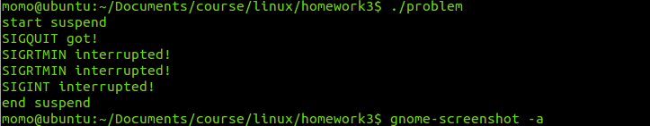
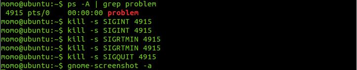

#Linux Homework 3

#####姓名: 王笑盈 &nbsp;&nbsp; 学号: 1252885 &nbsp;&nbsp; 日期: 2014年12月

######<https://github.com/wangxiaoying/linux-homework>
---

###题目 1

#####题目描述：Write a program to handle the exception of divided by 0.

#####提交：
- 源文件：signal.c
- 可执行文件：signal

#####执行：


###题目 2

#####题目描述：What problems are there for normal signal handling?

#####解答：
```
Linux中信号可分为实时信号和非实时信号，而实时信号之所以较非实时信号可靠是因为在进程阻塞该信号时间内，发给该进程的所有实时信号会排队，而非实时信号则会合并为一个信号。
```

#####提交：
- 源文件：problem.c
- 可执行文件：problem

#####执行：



#####分析证明：
```
如上图，SIGINT是非实时信号，SIGRTMINT是实时信号，在suspend的时候，两个信号虽然都触发了两次，但是在信号队列中，SIGRTMINT保留了两个，而SIGINT只保留了一个。因此可证明，对于非实时信号的处理，相同的非实时信号会合并成一个，这样就会造成信号的丢失，使其不如实时信号可靠。
```

